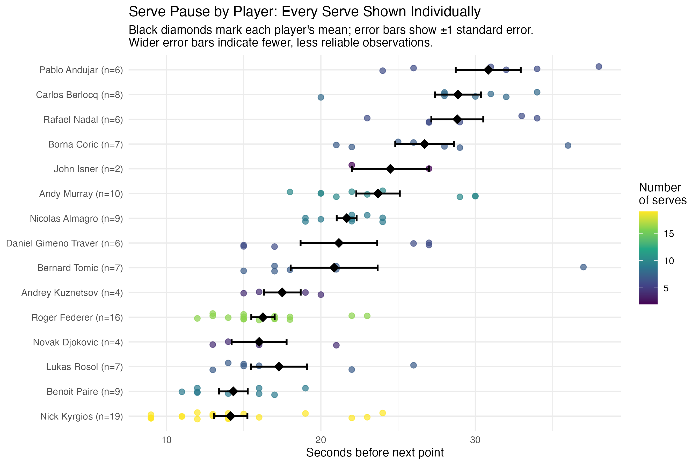
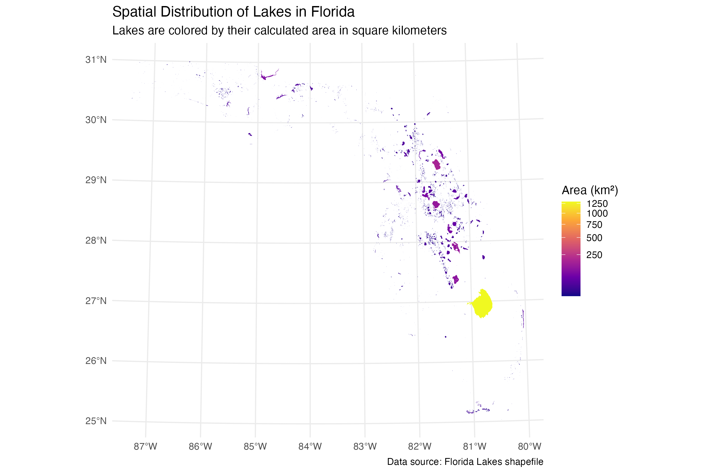
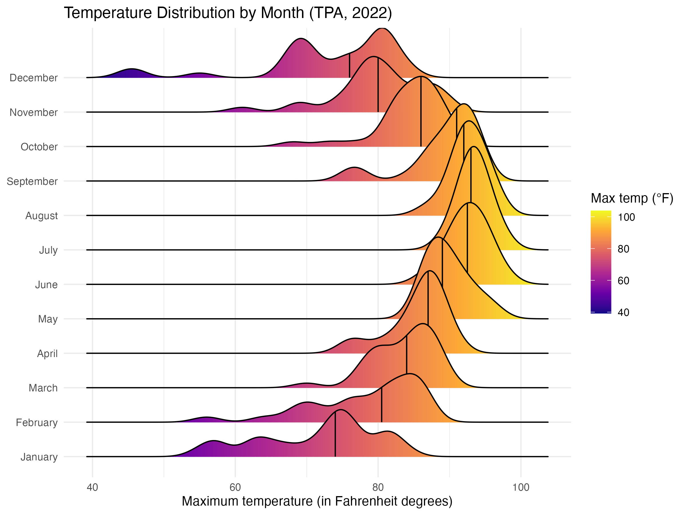

# Data Visualization and Reproducible Research

> Tugba Gueneysu

The following is a sample of products created during the *"Data Visualization and Reproducible Research"* course.

## Project 01

In the `project-01/` folder you can find a revised analysis of serve pause times for 15 professional tennis players across 120 serves recorded at Roland Garros 2015. The original version of this project compared player averages without accounting for very uneven sample sizes (2 to 19 serves per player) and drew conclusions about player personality and mental state that the data could not support. This revised version restricts boxplots and pressure comparisons to players with enough observations to support them, labels every figure with its underlying sample size and uncertainty, replaces the binary "pressure" variable with a more defensible ordered one, makes full use of the `set`, `game`, `game_score`, and `opponent` variables, and includes an interactive `plotly` chart (saved as a self-contained `.html`), a full before/after chart redesign, and colorblind-safe (`viridis`) figures with alt text throughout.

**Sample data visualization:**

My favorite chart from this project is the dot plot of every individual serve, with each player's mean marked and labeled with its sample size and standard error, since it shows the actual reliability behind each player's number instead of hiding it behind a single bar.

## Project 02

In this project, I explored the spatial distribution and physical characteristics of lakes across Florida, using the Florida Lakes shapefile dataset, motivated by how visible lakes turned out to be as a feature of everyday life while living in Lakeland. Find the code and report in the `project-02/` folder. This revised version adds a fitted linear model with a coefficient plot and confidence intervals (rather than relying on a trend line alone), an interactive Leaflet map saved as a self-contained `.html` file, accessibility improvements (`fig.alt` text and colorblind-safe `viridis` palettes on every static figure), and a cleaned-up report free of leftover console exploration output.

**Sample data visualization:**

My favorite visualization from this project is the spatial map of all 4,243 Florida lakes, colored by area, since it captures both how numerous Florida's lakes are and how dramatically a single lake (Lake Okeechobee) dominates the size distribution.

(you can place your figures in the `figures/` folder and use the `` option to add the pictures here)

## Project 03

In this project, I explored two different datasets: daily weather station data from Tampa International Airport (2022) and a concrete compressive strength dataset from the UCI Machine Learning Repository. For the weather data, I recreated faceted histograms, single and faceted density plots, and a ridgeline plot with quantile lines, plus my own visualization of monthly precipitation. For the concrete data, I explored the distributions of cement content and compressive strength, a boxplot of strength by age, and a multi-variable scatterplot of strength against cement, age, and water content, built as both a static and an interactive `plotly` chart. This project also includes a full before/after redesign of an early, problematic version of the strength histogram (flat non-colorblind-safe red fill, no axis units, an uninformative title) into a colorblind-safe, properly labeled, log-scaled version.

**Sample data visualization:**

My favorite visualization from this project is the ridgeline plot of maximum temperatures by month, since the plasma color gradient combined with the median quantile lines makes Tampa's seasonal temperature shift from winter to summer immediately visible across all twelve months at once.

### Moving Forward

Working through these three revisions taught me that a chart can look complete and still be misleading if it does not show the reader how much data actually supports it. Across all three projects, the most consistent fix was the same: show raw points or sample sizes instead of hiding them behind a single summary number, and use color and scale transformations (log scales, viridis palettes) deliberately rather than as decoration. Going forward, I want to keep applying this kind of sample-size awareness and accessibility-first thinking (colorblind-safe palettes, alt text) by default in any data visualization work I do, rather than treating it as an afterthought added only after feedback.
